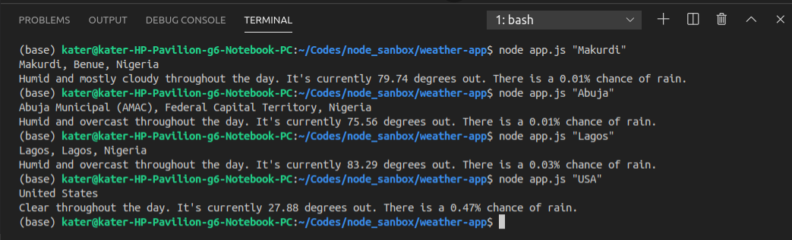
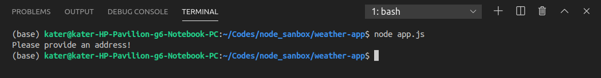

# Asynchronous Weather Application Build with Node.JS

## Features

    - Forcast using the Darksky API
    - Geocoding using the Mapbox API
    - Inputs from Command Line Interface (CLI)

## Demo

## NPM Dependences

    "axios": "^0.19.2"
    "dotenv": "^8.2.0"
